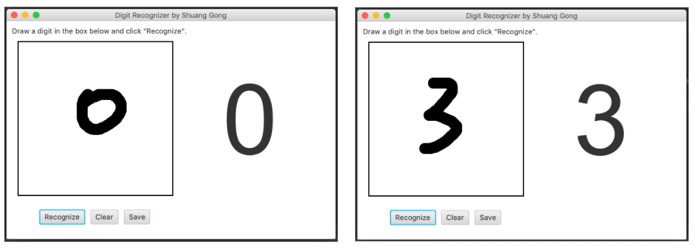
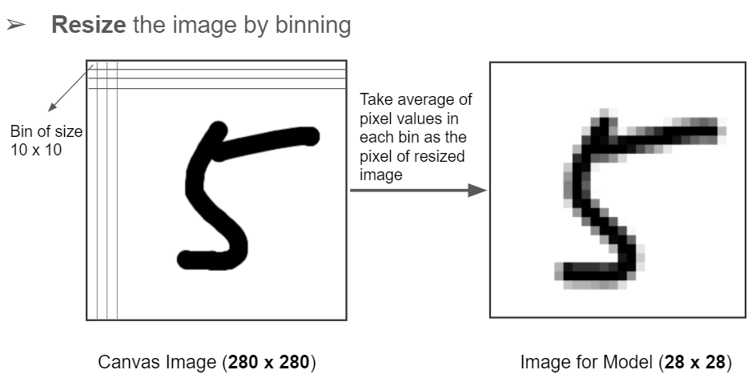
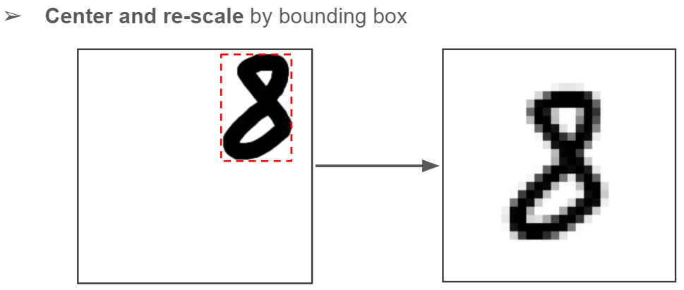

# Real-Time Handwirrten Digit Recognizer
JavaFX implementation with a CNN model

## Prerequisites
 - Java JDK 1.8 or greater
 - Tensorflow 1.13.1
 - Gradle 4.10 or greater
 
## CNN Model Training
Run python script `mnist_train.py` to build a CNN model using MNIST dataset

## App Screenshot

## Customized Improvement
Initially, the prediction accuracy is not that high and not even stable. To improve the prediction performance, we did two types of pre-processing for the input image to ensure it would be similar to training images.

1. Resize the image by **binning**

2. Center and re-scale by **bounding box**

See more details in the [slides](https://docs.google.com/presentation/d/11twxj6jNZ4dvCdNk9bPHHwe7Np3E0No9Lruh-o57UGg/edit?usp=sharing).
